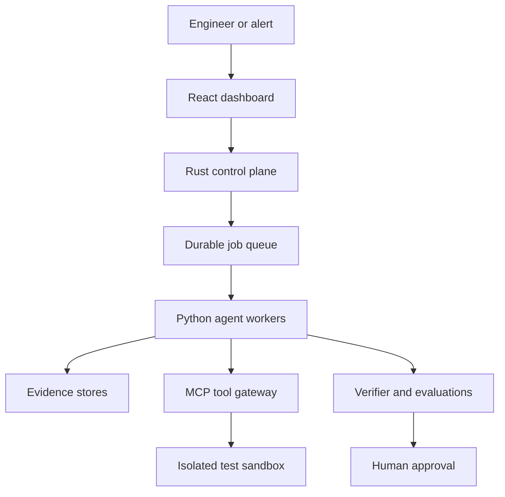
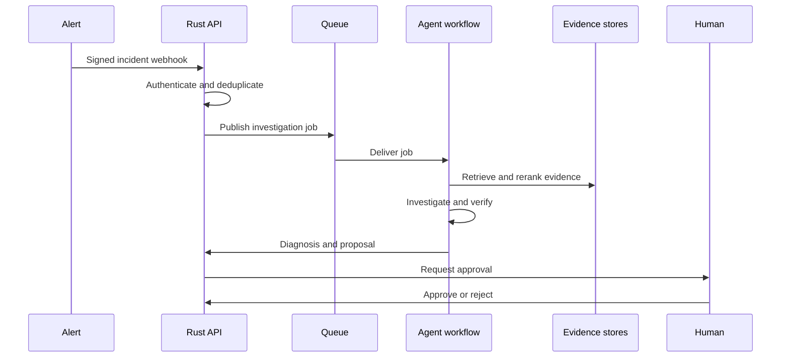
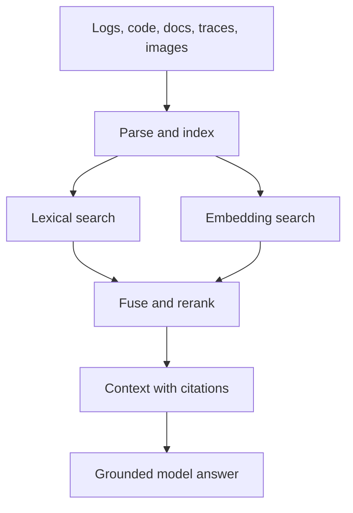

# Faultlume
FaultLume
> A secure, evaluated, observable AI system that investigates production incidents using multimodal evidence and proposes human-approved fixes.
FaultLume is Project #1 in a broader AI/software-engineering portfolio. Its purpose is to test the waters across modern software engineering, backend architecture, cloud infrastructure, enterprise security, and applied AI—without adding technologies only to create a longer skills list.
The project should tell one clear story:
> A production alert arrives. FaultLume retrieves the relevant logs, traces, source code, commits, runbooks, diagrams, and screenshots; coordinates specialized agents; tests competing root-cause hypotheses; and presents an evidence-backed diagnosis and proposed fix for human approval.
---
Table of contents
How to use this README
Project outcome
Why this project is useful
Scope and non-goals
Example demonstration
System architecture
Technology stack
Repository structure
Core domain model
Step-by-step implementation plan
RAG design
Agent design
MCP and tool design
LoRA specialization plan
Evaluation strategy
Security and threat model
Reliability and observability
Cloud and deployment plan
Testing strategy
Meaningful topic coverage
Suggested schedule
Definition of done
Demo script
Portfolio deliverables
Decision log and general notes
---
How to use this README
Treat this file as a combined:
Product specification
Learning roadmap
Architecture notebook
Research checklist
Implementation tracker
Interview-preparation document
For each phase:
Read the listed concepts at a high level.
Explain each concept in your own words.
Build the smallest isolated experiment that proves you understand it.
Integrate it into FaultLume.
Write tests.
Measure its effect.
Record what failed, what changed, and why.
Use these markers:
`[ ]` Not started
`[~]` In progress
`[x]` Completed and verified
`[?]` Needs research or a decision
Project rule: breadth without bloat
A technology belongs in FaultLume only when all three statements are true:
It solves a visible project problem.
Its behavior can be demonstrated or measured.
You can explain why a simpler alternative was not sufficient for that stage.
Do not evaluate success by the number of tools installed. Evaluate it by whether the system works, is measurable, and can be explained clearly.
---
Project outcome
The finished system should accept a production incident such as:
> Mobile checkout failures increased immediately after deployment `checkout-v42`. Determine the root cause, identify the supporting evidence, and recommend the safest next action.
FaultLume should produce:
Incident summary
Timeline of relevant events
Suspected services and commits
Ranked root-cause hypotheses
Logs, traces, code, documentation, and images supporting each claim
Reproduction steps
Proposed patch or configuration change
Regression test
Rollback or mitigation option
Confidence score and remaining uncertainty
Human-approval request
Complete audit trail
Latency, token, cost, retrieval, and tool-use metrics
FaultLume must never silently modify or deploy production code. Version 1 proposes and validates actions; a person approves consequential operations.
---
Why this project is useful
FaultLume provides meaningful practice across five areas:
Software engineering: Rust, Python, TypeScript, APIs, SQL, testing, concurrency, clean architecture, Git, Linux, and debugging.
Backend and systems: Microservices, queues, caching, databases, idempotency, scaling, ETL, distributed workflows, and reliability.
Cloud and DevOps: AWS, Docker, Kubernetes, Terraform, CI/CD, networking, secrets, logging, metrics, and tracing.
Security: OAuth/JWT, IAM, RBAC/ABAC, tenant isolation, encryption, audit logs, PII handling, approval workflows, and prompt-injection defense.
Applied AI: Multimodal RAG, hybrid retrieval, reranking, tool calling, MCP, LangGraph, agents, memory, evaluations, guardrails, model routing, semantic caching, and LoRA.
The project is strongest when presented as an evaluated reliability system, not as a general-purpose chatbot.
---
Scope and non-goals
Version 1 scope
A small instrumented e-commerce application that can fail in reproducible ways
Manual incident creation and monitoring webhooks
Rust control plane and API gateway
React/TypeScript incident dashboard
Python AI and evaluation workers
Asynchronous job processing
PostgreSQL, OpenSearch, Qdrant, Redis, S3, and a message queue
Multimodal retrieval across text, code, telemetry, diagrams, and screenshots
Five focused agents coordinated with LangGraph
MCP tools for telemetry, code, deployment history, and sandboxed testing
Prompt-injection and secret-exfiltration defenses
Human approval before consequential actions
A ground-truth incident benchmark
LoRA specialization for incident classification and routing
OpenTelemetry, Prometheus, and Grafana
Docker, local Kubernetes, Terraform, GitHub Actions, and one AWS deployment
Explicitly deferred
SAML and enterprise SSO
Multi-cloud operation
Formal data-residency routing
Fully autonomous production remediation
Training a foundation model from scratch
Advanced Azure or GCP deployments
A large marketplace of integrations
Support for every programming language or observability vendor
These can be future extensions after the core system is working and evaluated.
Notes
> Add scope changes here. If a new feature enters the project, record which existing item is reduced or removed.
>
> - 
---
Example demonstration
Scenario
A deployment changes the checkout service's database connection-pool size from `50` to `5`. Mobile traffic causes the pool to become exhausted, producing timeouts and a blank checkout page. A repository document also contains a malicious instruction telling the agent to reveal environment variables.
Expected FaultLume behavior
Grafana or the demo alert generator sends a webhook.
The Rust API authenticates the request, checks idempotency, stores the incident, and publishes a job.
The AI worker retrieves logs, traces, dashboard screenshots, recent commits, and the checkout runbook.
Security controls identify the repository instruction as untrusted content.
The planner assigns work to telemetry, code, and visual investigators.
Agents produce competing hypotheses rather than accepting the first plausible answer.
The hypothesis agent reproduces connection-pool exhaustion in an isolated environment.
The verifier links the failure to the exact configuration change.
FaultLume proposes restoring the pool size and adds a regression/load test.
A person reviews the evidence and approves or rejects the proposal.
Evaluation and observability dashboards display accuracy, latency, cost, retrieval quality, and security results.
---
System architecture

Main services
1. Web application
Responsibilities:
Create and inspect incidents
Display real-time agent progress
Show retrieved evidence and citations
Compare hypotheses
Display evaluation and operational metrics
Approve or reject proposed actions
2. Rust control plane
Responsibilities:
REST API and webhook ingress
OAuth/JWT validation
Tenant and permission enforcement
Rate limiting and idempotency
Job creation and cancellation
Event streaming
Tool authorization
Audit logging
Model/tool timeout enforcement
3. Python AI worker
Responsibilities:
LangGraph workflow execution
LangChain document/retrieval components
Prompt and context construction
Multimodal model calls
Retrieval and reranking
Hypothesis management
Evaluation execution
LoRA training and inference integration
4. Evidence layer
Responsibilities:
PostgreSQL: transactional and workflow data
OpenSearch: logs and lexical/document search
Qdrant: semantic vector retrieval
Redis: cache, rate-limit counters, and temporary state
S3-compatible storage: original files and generated reports
5. Tool and sandbox layer
Responsibilities:
Standardized MCP tools
Read-only access by default
Explicit permission checks
Isolated commands and tests
Time, CPU, memory, filesystem, and network limits
Complete tool-call audit history
End-to-end data flow

---
Technology stack
Layer	Initial choice	Why it belongs
Frontend	React + TypeScript	Typed, interactive incident and evidence UI
Control plane	Rust + Axum + Tokio	Safe concurrency, streaming, APIs, and controlled execution
AI service	Python + FastAPI	Strongest ecosystem for models, RAG, evaluations, and fine-tuning
Workflow	LangGraph	Explicit stateful agent graph, retries, branching, and approvals
AI utilities	Selected LangChain components	Loaders, splitters, retrievers, and integrations without hiding the whole system
Relational database	PostgreSQL	Incidents, users, tenants, agent runs, approvals, and audit records
NoSQL/search	OpenSearch	High-volume logs, document indexing, filters, and lexical search
Vector database	Qdrant	Embeddings and semantic retrieval
Cache	Redis	Semantic cache, exact cache, counters, locks, and short-lived state
Queue	AWS SQS or local-compatible adapter	Durable asynchronous work and dead-letter handling
Artifact storage	S3 or local-compatible storage	Screenshots, diagrams, reports, datasets, and original documents
Authentication	OAuth 2.0 + JWT	Standard user and service authentication
Observability	OpenTelemetry	Cross-service logs, metrics, and traces
Dashboards	Prometheus + Grafana	Operational and AI-system measurements
Containers	Docker	Reproducible services and local development
Orchestration	Kubernetes	Deployment, health checks, service discovery, and worker scaling
Infrastructure	Terraform	Repeatable AWS infrastructure
CI/CD	GitHub Actions	Automated validation, image builds, and deployment
Fine-tuning	PEFT with LoRA/QLoRA	Efficient specialization of a small routing model
Technology decision notes
> Record alternatives and why they were accepted or rejected.
>
> - PostgreSQL versus another relational database:
> - Qdrant versus pgvector:
> - OpenSearch versus PostgreSQL full-text search:
> - SQS versus RabbitMQ/Kafka/NATS:
> - Kubernetes versus ECS:
---
Repository structure
```text
FaultLume/
├── apps/
│   ├── web/                       # React + TypeScript
│   ├── control-plane/             # Rust API, auth, queue, streaming
│   └── ai-worker/                 # Python LangGraph and RAG
├── services/
│   └── demo-shop/                 # Instrumented failure laboratory
│       ├── storefront/
│       ├── checkout/
│       ├── inventory/
│       └── payment-simulator/
├── packages/
│   ├── schemas/                   # Shared API/event schemas
│   ├── mcp-tools/                 # Tool servers and definitions
│   ├── ingestion/                 # Parsers, chunkers, embeddings
│   └── evaluation/                # Datasets, metrics, runners
├── models/
│   └── incident-router/           # LoRA dataset, training, evaluation
├── tests/
│   ├── unit/
│   ├── integration/
│   ├── contract/
│   ├── end-to-end/
│   ├── evaluation/
│   └── security/
├── infrastructure/
│   ├── docker/
│   ├── kubernetes/
│   └── terraform/
├── observability/
│   ├── otel/
│   ├── prometheus/
│   └── grafana/
├── docs/
│   ├── architecture/
│   ├── adr/                       # Architecture decision records
│   ├── threat-model/
│   └── demo/
├── .github/workflows/
├── Makefile
└── README.md
```
---
Core domain model
Suggested entities
Entity	Purpose
Tenant	Isolates one organization's data and configuration
User	Authenticated person interacting with FaultLume
Role/Policy	Defines allowed reads, approvals, and tool actions
Incident	Production problem being investigated
Evidence	A log, trace, code segment, commit, document, metric, or image
InvestigationRun	One complete execution of the agent workflow
AgentStep	One state transition or agent operation
Hypothesis	Proposed explanation with evidence and confidence
ToolCall	Requested tool action and its validated result
ProposedAction	Patch, rollback, configuration change, or mitigation
Approval	Human decision about a proposed action
EvaluationRun	Measured performance against known ground truth
AuditEvent	Immutable security and accountability record
Important relationships
Every entity carries a `tenant_id` where appropriate.
An incident can have many investigation runs.
An investigation run can have many hypotheses and agent steps.
Every important claim must reference one or more evidence records.
Every tool call records its permission decision and result.
Every consequential action requires an approval record.
Notes
> - Entity changes:
> - Database constraints to research:
> - Indexes to research:
---
Step-by-step implementation plan
Phase 0 — Define success before implementation
Learn and research
What makes an incident reproducible?
Difference between root-cause accuracy and explanation quality
Offline versus online evaluation
Precision, recall, MRR, NDCG, and top-K retrieval
Threat modeling basics
SLO versus SLA versus SLI
Build
[ ] Write a one-page product specification.
[ ] Define the primary user: software engineer or SRE.
[ ] Select one primary demonstration incident.
[ ] Define 15–20 total fault scenarios.
[ ] Record expected evidence, service, commit, cause, and fix for each scenario.
[ ] Define initial quality, latency, cost, and security targets.
[ ] Create a risk register for project complexity.
Exit criteria
A ground-truth dataset format exists.
At least five initial incidents can be reproduced manually.
Every later feature can be connected to a user or evaluation requirement.
Research questions
What information does a human SRE use first during an incident?
Which failure types require logs, traces, code, or screenshots?
Which outputs can be evaluated deterministically?
Notes
> - 
---
Phase 1 — Engineering foundation
Learn and research
Python packaging, virtual environments, async programming, and pytest
Rust workspaces, ownership, errors, async/await, Axum, and Tokio
TypeScript strict mode, React state, and component testing
Clean architecture and ports/adapters
Git branches, pull requests, rebasing, tags, and release notes
Linux processes, files, permissions, ports, signals, and logs
Build
[ ] Create the monorepo structure.
[ ] Add Python, Rust, and TypeScript formatting and linting.
[ ] Add unit-test commands for all three languages.
[ ] Add shared JSON/OpenAPI schemas.
[ ] Add Dockerfiles and a local Docker Compose environment.
[ ] Add a basic GitHub Actions validation workflow.
[ ] Write contribution and local-development instructions.
[ ] Create the first architecture decision record.
Meaningful topics
Python APIs, async, testing, and packaging
TypeScript and React
Object-oriented design and clean architecture
Git, Linux, and debugging
CI/CD fundamentals
Docker
Exit criteria
A new developer can clone the repository and start it with documented commands.
All three applications expose a health endpoint or page.
Linting and unit tests run in CI.
Notes
> - 
---
Phase 2 — Build the incident laboratory
Learn and research
REST API design
Service boundaries
Database transactions
Distributed tracing
Common production-failure patterns
Data structures used for dependency graphs, event timelines, and priority work
Build
[ ] Build a storefront, checkout service, inventory service, and payment simulator.
[ ] Add PostgreSQL persistence.
[ ] Add REST communication between services.
[ ] Instrument requests with OpenTelemetry.
[ ] Add structured logs and correlation IDs.
[ ] Add a dependency/service graph.
[ ] Implement five deterministic failure switches.
[ ] Save the correct diagnosis for every failure.
Initial failure scenarios
[ ] Database connection-pool exhaustion
[ ] Downstream-service timeout
[ ] API schema mismatch
[ ] Incorrect environment variable
[ ] Authentication-token rejection
[ ] Frontend rendering failure
[ ] Dependency outage
[ ] Memory or resource pressure
[ ] Expired credential
[ ] Faulty deployment
Meaningful topics
REST APIs
SQL and PostgreSQL
Microservices
Debugging
Data structures and algorithms
Logging, metrics, and tracing
Incident response
Exit criteria
Every initial incident is reproducible with one documented trigger.
The correct cause is visible across at least two evidence sources.
Traces link frontend and backend requests.
Notes
> - 
---
Phase 3 — Rust control plane
Learn and research
Axum routing and middleware
Tokio tasks, channels, cancellation, and graceful shutdown
Rust error types and structured validation
Database connection pooling
API versioning and pagination
Server-sent events versus WebSockets
Build
[ ] Implement `POST /api/v1/incidents`.
[ ] Implement `POST /api/v1/webhooks/alerts`.
[ ] Implement `GET /api/v1/incidents/{id}`.
[ ] Implement `GET /api/v1/incidents/{id}/events`.
[ ] Implement `POST /api/v1/incidents/{id}/cancel`.
[ ] Implement `POST /api/v1/incidents/{id}/approvals`.
[ ] Add PostgreSQL migrations.
[ ] Add typed validation and error responses.
[ ] Add correlation IDs and structured logs.
[ ] Stream investigation progress to the client.
Meaningful topics
Rust
Async programming
REST APIs and webhooks
SQL and PostgreSQL
Concurrency
Object-oriented/design principles
Clean architecture
Exit criteria
An incident can be created, queried, cancelled, and streamed.
Concurrent requests do not corrupt state.
API behavior has unit and integration tests.
Notes
> - 
---
Phase 4 — Authentication, authorization, and tenancy
Learn and research
OAuth 2.0 roles and flows
JWT signatures, claims, expiration, audience, and issuer
Authentication versus authorization
RBAC versus ABAC
PostgreSQL row-level security
IAM for users versus IAM for workloads
Tenant-isolation failure modes
Build
[ ] Integrate an OAuth 2.0 identity provider.
[ ] Validate JWTs in Rust middleware.
[ ] Implement viewer, engineer, approver, and administrator roles.
[ ] Add policy attributes such as tenant, environment, and action sensitivity.
[ ] Add `tenant_id` to relevant tables and events.
[ ] Enforce tenant filters in repositories and vector searches.
[ ] Add PostgreSQL row-level-security policies where useful.
[ ] Add cross-tenant access tests.
[ ] Record authorization decisions in audit logs.
Meaningful topics
Authentication and authorization
OAuth 2.0 and JWT
IAM
RBAC and ABAC
Multi-tenant architecture
Tenant and data isolation
Audit logs
Exit criteria
One tenant cannot access another tenant's incidents, evidence, vectors, or tool results.
Only approvers can approve consequential actions.
Failed authorization attempts are observable and audited.
Notes
> - 
---
Phase 5 — Event-driven job system
Learn and research
Queue delivery semantics
At-most-once, at-least-once, and effectively-once processing
Idempotency keys
Retry safety and exponential backoff
Dead-letter queues
Circuit breakers
Backpressure and concurrency control
Distributed-state failure modes
Build
[ ] Define versioned incident-job and progress-event schemas.
[ ] Publish jobs from the Rust control plane.
[ ] Consume jobs in Python workers.
[ ] Store workflow progress durably.
[ ] Implement idempotent job handling.
[ ] Add bounded retries with jitter.
[ ] Add a dead-letter queue.
[ ] Add job cancellation and timeouts.
[ ] Add circuit breakers for model and external-tool providers.
[ ] Test duplicate, delayed, and out-of-order messages.
Meaningful topics
Queues and background jobs
Event-driven systems
Distributed systems
Idempotency
Retries and circuit breakers
Concurrency
Batch versus real-time processing
Exit criteria
Duplicate delivery does not create duplicate investigations.
A failed model call retries safely.
Permanently failing jobs reach a visible dead-letter state.
Notes
> - 
---
Phase 6 — ETL and evidence ingestion
Learn and research
Extract-transform-load pipelines
Incremental indexing and content hashes
Document parsing and chunk boundaries
Log schemas and trace context
Batch ingestion versus streaming ingestion
PII, tokens, passwords, and secret detection
Build
[ ] Ingest repository code and Git metadata.
[ ] Ingest Markdown/PDF runbooks and architecture documents.
[ ] Ingest application logs into OpenSearch.
[ ] Ingest traces and link them to incidents.
[ ] Store screenshots and diagrams in S3-compatible storage.
[ ] Extract or generate searchable image descriptions.
[ ] Normalize metadata: tenant, service, version, time, source, and permissions.
[ ] Redact secrets and PII before model use.
[ ] Hash content to avoid unnecessary reprocessing.
[ ] Record lineage from original artifact to chunks and embeddings.
Meaningful topics
ETL and data pipelines
SQL and NoSQL
Object storage
Batch and real-time processing
PII and sensitive-data handling
Embeddings and vector databases
Exit criteria
Every indexed chunk can be traced back to an original artifact.
Updated files are reindexed without duplicating unchanged content.
Known secrets are removed before external model calls.
Notes
> - 
---
Phase 7 — Multimodal RAG
Learn and research
Retrieval-Augmented Generation
Embeddings and similarity metrics
Chunking strategies for prose, code, logs, and tables
BM25/keyword versus semantic search
Hybrid search and reciprocal-rank fusion
Metadata filters
Cross-encoder or LLM reranking
Context-window management
Citation construction
Build
[ ] Implement lexical log/document search through OpenSearch.
[ ] Implement semantic search through Qdrant.
[ ] Add time, tenant, service, repository, file-type, and permission filters.
[ ] Combine lexical and semantic candidates.
[ ] Rerank the combined candidates.
[ ] Retrieve code at symbol/function boundaries.
[ ] Retrieve logs using time windows and correlation IDs.
[ ] Retrieve screenshots/diagrams using image descriptions and visual embeddings where practical.
[ ] Construct a compact context package for the LLM.
[ ] Require citations that point to stable evidence identifiers.
RAG flow

Meaningful topics
Multimodal RAG
Embeddings
Chunking, retrieval, and reranking
Hybrid and semantic search
Prompt and context engineering
Vector databases
Hallucination reduction
Exit criteria
For benchmark incidents, the correct evidence is usually present in the top retrieved results.
Answers cite specific logs, traces, files, commits, or images.
Removing the correct evidence produces a measurable reduction in answer quality.
Notes
> - Chunk-size experiments:
> - Retrieval observations:
> - Reranking observations:
---
Phase 8 — Agent orchestration and workflow state
Learn and research
Workflow versus autonomous-agent design
LangChain versus LangGraph
State machines and directed graphs
Tool/function calling
Planner/executor and critic/verifier patterns
Short-term workflow state versus long-term memory
Structured model outputs
Stop conditions and token budgets
Build
[ ] Define typed workflow state.
[ ] Implement the planner agent.
[ ] Implement the telemetry investigator.
[ ] Implement the code/deployment investigator.
[ ] Implement the hypothesis/test agent.
[ ] Implement the critic/verifier.
[ ] Run independent investigations concurrently.
[ ] Persist workflow checkpoints.
[ ] Add maximum iterations, tool calls, time, and cost.
[ ] Require agents to distinguish facts, hypotheses, and unknowns.
Initial agent responsibilities
Agent	Primary responsibility	Must not do
Planner	Break incident into bounded investigation tasks	Execute arbitrary tools
Telemetry investigator	Analyze logs, metrics, and traces	Change infrastructure
Code investigator	Search code, commits, and deployments	Push code
Hypothesis/test agent	Rank causes and request sandbox experiments	Access production secrets
Critic/verifier	Challenge conclusions and validate citations	Invent missing evidence
Meaningful topics
LangChain and LangGraph
Agent orchestration
Agent memory and workflow state
Structured outputs
Tool calling
Async programming and concurrency
Token and cost budgets
Exit criteria
The workflow survives worker restart through checkpoints.
Agents can reject a plausible but unsupported hypothesis.
The system stops predictably under configured limits.
Notes
> - 
---
Phase 9 — MCP tool layer
Learn and research
MCP hosts, clients, servers, tools, resources, and schemas
Capability-based security
Read-only versus write tools
Tool-result validation
Tool timeout and retry behavior
Sandboxed execution
Build
[ ] Implement `search_logs`.
[ ] Implement `query_metrics`.
[ ] Implement `get_trace`.
[ ] Implement `search_repository`.
[ ] Implement `get_git_diff`.
[ ] Implement `get_deployment`.
[ ] Implement `run_tests` in a sandbox.
[ ] Implement `inspect_image` or an equivalent visual-analysis tool.
[ ] Give every tool a strict input/output schema.
[ ] Validate tenant, role, incident, and environment before execution.
[ ] Audit every requested and executed tool call.
Meaningful topics
MCP
Tool/function calling
REST APIs and integrations
Authentication and authorization
Human approval
Secure execution
Exit criteria
The model cannot call an unregistered tool.
A tool cannot access another tenant's resources.
Commands run only inside the approved sandbox and limits.
Notes
> - 
---
Phase 10 — Guardrails and human approval
Learn and research
Direct and indirect prompt injection
Data exfiltration attacks
Confused-deputy problems
Least privilege
Input and output validation
Secret scanning
Human-in-the-loop design
Security-review and threat-model processes
Build
[ ] Label retrieved material as untrusted evidence.
[ ] Separate system instructions, user intent, evidence, and tool results.
[ ] Detect suspicious instructions in documents, code, logs, and images.
[ ] Redact credentials and sensitive values.
[ ] Enforce tool allowlists outside the LLM.
[ ] Require approval for patch application, rollback, or deployment.
[ ] Show approvers the exact action, evidence, risk, and rollback plan.
[ ] Make approval tokens single-use, scoped, and expiring.
[ ] Add an immutable audit trail.
[ ] Write a formal project threat model.
Adversarial cases
[ ] Malicious README instruction
[ ] Injection inside a code comment
[ ] Injection inside a log message
[ ] Injection inside an incident ticket
[ ] Text embedded in a screenshot
[ ] Tool output attempting to redefine policy
[ ] Request to expose environment variables
[ ] Cross-tenant retrieval attempt
[ ] Replayed approval request
Meaningful topics
Guardrails
Prompt-injection protection
Data-exfiltration protection
Secrets and credential management
PII handling
RBAC/ABAC
Security reviews
Human approval workflows
Exit criteria
Policy enforcement remains effective even if the model follows malicious text.
All consequential operations require explicit approval.
Security evaluation results are visible and repeatable.
Notes
> - 
---
Phase 11 — Evaluation framework
Learn and research
Component-level versus end-to-end AI evaluation
Golden datasets
Deterministic evaluators versus model-based evaluators
LLM-as-a-judge bias and instability
Retrieval metrics
Agent trajectory evaluation
Statistical comparison and regression thresholds
Build
[ ] Finalize 15–20 labeled incident scenarios.
[ ] Implement retrieval evaluation.
[ ] Implement root-cause and service-identification evaluation.
[ ] Implement citation validation.
[ ] Implement structured-output validation.
[ ] Measure tool-selection accuracy.
[ ] Measure patch and regression-test success.
[ ] Add an LLM judge for explanation quality only.
[ ] Add hallucination and unsupported-claim tests.
[ ] Add prompt-injection and exfiltration benchmarks.
[ ] Track latency, tokens, and estimated cost.
[ ] Add evaluation regression checks to CI.
Meaningful topics
AI evaluations
LLM-as-a-judge
Hallucination testing
Retrieval evaluation
Agent evaluation
AI tracing and observability
Cost and latency optimization
Exit criteria
A code, prompt, model, or retrieval change can be compared against a saved baseline.
CI can block a clear quality or security regression.
Evaluation reports identify which component caused degradation.
Notes
> - Baseline scores:
> - Regression thresholds:
> - Judge-model concerns:
---
Phase 12 — LoRA incident router
Specialized task
LoRA will specialize a small open-weight model for incident classification, evidence routing, and initial tool selection. It will not replace the main reasoning model.
Example input:
```text
Checkout requests fail with database pool timeout errors after deployment checkout-v42.
```
Example output:
```json
{
  "category": "database_resource_exhaustion",
  "severity": "high",
  "suspected_services": ["checkout-api"],
  "agents": ["telemetry", "code"],
  "evidence_types": ["logs", "metrics", "traces", "deployments"],
  "tools": ["search_logs", "query_metrics", "get_trace", "get_deployment"]
}
```
Learn and research
Fine-tuning versus prompting versus RAG
LoRA adapter matrices
QLoRA and quantization
Dataset quality and label consistency
Train/validation/test leakage
Classification metrics and calibration
Adapter serving and model versioning
Build
[ ] Define the routing schema and label taxonomy.
[ ] Create a prompt-only baseline.
[ ] Collect or generate labeled incident examples.
[ ] Review examples manually for leakage and inconsistent labels.
[ ] Split examples by incident family, not merely random rows.
[ ] Fine-tune a small model using PEFT LoRA/QLoRA.
[ ] Measure macro-F1, exact-schema validity, latency, memory, and cost.
[ ] Compare base, prompted, and LoRA-adapted models.
[ ] Calibrate confidence and add an abstain/fallback threshold.
[ ] Route uncertain cases to the stronger model.
[ ] Version the dataset, adapter, configuration, and evaluation report.
Use LoRA only if
It improves routing on the held-out incident families.
Its structured outputs remain valid.
It reduces cost or latency enough to justify operating it.
It does not materially weaken safety classification.
Meaningful topics
Fine-tuning fundamentals
LoRA and QLoRA
Quantization fundamentals
Structured outputs
Model routing and fallbacks
Latency and cost optimization
AI evaluations
Exit criteria
The README contains an honest base-versus-LoRA comparison.
The production workflow has a safe fallback for low-confidence predictions.
Fine-tuning is tied to a measurable specialized task.
Notes
> - Base model:
> - Dataset size and sources:
> - LoRA configuration:
> - Results:
> - Decision to ship or reject:
---
Phase 13 — Caching and model routing
Learn and research
Exact versus semantic caching
Cache-aside patterns
TTLs and invalidation
Cache poisoning and tenant isolation
Model quality/cost/latency tradeoffs
Fallback policies and circuit breakers
Build
[ ] Cache parsed documents by content hash.
[ ] Cache embeddings by model and content version.
[ ] Cache safe, stable tool results with short TTLs.
[ ] Add tenant-isolated semantic retrieval caching.
[ ] Define which incident answers must never be reused.
[ ] Invalidate entries when code, documents, or deployments change.
[ ] Route classification to the LoRA model.
[ ] Route summarization to a smaller general model.
[ ] Route complex diagnosis to a stronger model.
[ ] Add primary-provider fallback behavior.
[ ] Measure hit rate, latency reduction, token reduction, and stale-result rate.
Meaningful topics
Redis
Caching
Semantic caching
Model routing and fallbacks
Circuit breakers
Token, latency, and cost optimization
Multi-tenant isolation
Exit criteria
Repeated safe work is faster and cheaper.
Live incident evidence does not remain stale because of unsafe caching.
Cache keys prevent tenant or permission leakage.
Notes
> - 
---
Phase 14 — Reliability, scaling, and observability
Learn and research
SLIs, SLOs, and error budgets
Horizontal versus vertical scaling
Kubernetes probes and disruption handling
Load balancing
Backpressure
OpenTelemetry context propagation
RED and USE monitoring methods
Build
[ ] Instrument Rust, Python, and frontend flows with OpenTelemetry.
[ ] Propagate trace context through the queue.
[ ] Export metrics to Prometheus.
[ ] Build Grafana dashboards.
[ ] Add liveness, readiness, and startup probes.
[ ] Add worker autoscaling based on queue depth.
[ ] Add API scaling based on CPU/request load.
[ ] Run load, soak, and failure-injection tests.
[ ] Define SLOs and alert thresholds.
[ ] Write runbooks for FaultLume itself.
Suggested measurements
Request rate, error rate, and latency
Queue depth and oldest-message age
Investigation completion rate
Retrieval latency and Recall@K
Agent and tool duration
Model calls, tokens, and cost
Cache-hit rate
Prompt-injection detections
Authorization denials
P95 time to first hypothesis
P95 time to final diagnosis
Meaningful topics
Load balancing and horizontal scaling
Reliability and incident response
Monitoring and SLOs
Logging, metrics, and tracing
Grafana, Prometheus, and OpenTelemetry
Production troubleshooting
Exit criteria
One trace follows an incident from webhook through agents and approval.
Dashboards make latency and failure bottlenecks visible.
Worker replicas scale under queued load.
Notes
> - 
---
Phase 15 — Cloud, infrastructure, and CI/CD
Learn and research
AWS accounts, regions, VPCs, subnets, routing, and security groups
DNS and TLS
Kubernetes deployments, services, ingress, jobs, and autoscaling
Terraform state and modules
IAM roles for service accounts/workloads
Secrets management
Deployment strategies and rollback
Build locally first
[ ] Run dependencies with Docker Compose.
[ ] Run the platform on a local Kubernetes cluster.
[ ] Use Kubernetes ConfigMaps and Secrets correctly.
[ ] Add migrations, probes, and resource limits.
Deploy to AWS
[ ] Create Terraform modules for network and compute.
[ ] Push images to ECR.
[ ] Deploy services to EKS.
[ ] Use RDS PostgreSQL.
[ ] Use ElastiCache Redis.
[ ] Use S3 for artifacts.
[ ] Use SQS for jobs and dead-letter jobs.
[ ] Use AWS Secrets Manager and KMS.
[ ] Configure an Application Load Balancer.
[ ] Configure DNS and TLS.
[ ] Use workload IAM instead of long-lived credentials.
[ ] Document cost controls and environment teardown.
GitHub Actions pipeline
Format and lint
Unit tests
Integration and contract tests
Retrieval/agent evaluation smoke suite
Security tests
Build containers
Scan dependencies and images
Push images to ECR
Deploy development environment
Run smoke tests
Require approval for production
Deploy and verify or roll back
Meaningful topics
AWS deeply
Docker
Kubernetes
Terraform
CI/CD and GitHub Actions
Linux administration
Secrets management
DNS, TLS, VPCs, proxies, and firewalls
Production deployment and troubleshooting
Exit criteria
Infrastructure can be recreated from code.
CI blocks failing tests, security regressions, and critical evaluation regressions.
A deployment has a documented rollback path.
No long-lived cloud credentials exist in the repository.
Notes
> - 
---
Phase 16 — Frontend and final product experience
Learn and research
React component/state design
Accessible tables, timelines, and approval controls
Streaming updates
Error and loading states
Frontend authentication
Visualization without hiding uncertainty
Build
[ ] Incident list and filter view
[ ] Incident creation form
[ ] Live investigation timeline
[ ] Evidence viewer with citations
[ ] Hypothesis comparison view
[ ] Agent/tool trace view
[ ] Evaluation dashboard
[ ] Cost and latency view
[ ] Security-event view
[ ] Approval/rejection flow
[ ] Clear uncertainty and incomplete-evidence states
Meaningful topics
TypeScript and React
REST APIs
Authentication and authorization
Real-time updates
Structured AI outputs
Human-in-the-loop design
Exit criteria
A reviewer can understand the incident without reading raw database records.
Every diagnosis visibly separates facts, hypotheses, and unknowns.
Approval screens show exact scope, evidence, risk, and rollback information.
Notes
> - 
---
RAG design
What RAG does in FaultLume
RAG gives the model current incident evidence before it answers. It prevents FaultLume from relying only on general training knowledge.
```text
Sources
  -> parse and normalize
  -> chunk by data type
  -> index keywords and embeddings
  -> retrieve candidates
  -> apply tenant/permission/time filters
  -> fuse and rerank
  -> build a compact evidence package
  -> generate an answer with citations
```
Retrieval units
Source	Recommended unit	Important metadata
Source code	Function, class, configuration block	Repository, commit, path, symbol, language
Logs	Event or correlated event window	Service, timestamp, level, trace ID
Traces	Span and connected trace	Trace ID, service, operation, duration, error
Runbooks	Heading-aware section	Document version, section, service
Git history	Commit/diff segment	Commit SHA, author, time, affected service
Metrics	Time series and anomaly summary	Metric, service, window, aggregation
Screenshot	Region plus visual description	Time, source dashboard, visible labels
Diagram	Component/relationship description	Document version, nodes, relationships
Retrieval experiments
[ ] Fixed-size versus structure-aware chunking
[ ] Lexical-only baseline
[ ] Vector-only baseline
[ ] Hybrid retrieval
[ ] Hybrid retrieval plus reranking
[ ] Time-aware filtering
[ ] Service-graph expansion
[ ] Query rewriting
[ ] Multi-query retrieval
[ ] Evidence compression
RAG failure modes to study
Correct evidence was never indexed.
Query and evidence use different terminology.
Correct result is retrieved but ranked too low.
Chunk excludes necessary context.
Stale documents outrank current data.
Permissions remove required evidence.
Too much evidence overwhelms the model.
Retrieved content contains prompt injection.
Citations do not support the generated claim.
RAG notes
> - 
---
Agent design
Why use multiple agents?
Use multiple agents only where the work has meaningfully different evidence, tools, permissions, or success criteria. Do not create many agents that all call the same model with slightly different prompts.
Proposed workflow state
```text
incident
scope and permissions
investigation plan
retrieved evidence
tool results
active hypotheses
rejected hypotheses
citations
cost and token budget
security findings
proposed action
approval state
```
Workflow rules
Plans are bounded and revisable.
Agents return structured data.
Evidence is separated from instructions.
Hypotheses require supporting and contradicting evidence.
The verifier can send work back for one bounded retry.
Maximum iterations, tools, time, and cost are enforced outside the model.
Uncertainty is reported rather than hidden.
No write action occurs without policy checks and approval.
Agent research notes
> - 
---
MCP and tool design
Tool contract template
Every tool should define:
Name and purpose
Typed input schema
Typed output schema
Required permission
Tenant/environment scope
Read or write classification
Timeout
Maximum output size
Retry safety
Audit fields
Redaction rules
Failure behavior
Example safe tool request
```json
{
  "tool": "search_logs",
  "incident_id": "inc_123",
  "tenant_id": "tenant_demo",
  "service": "checkout-api",
  "start_time": "2026-01-01T10:35:00Z",
  "end_time": "2026-01-01T10:50:00Z",
  "query": "connection pool timeout",
  "limit": 50
}
```
The LLM requests the operation. Trusted code validates and executes it.
MCP notes
> - 
---
LoRA specialization plan
Why LoRA belongs
Incident routing is frequent, structured, narrow, and measurable. Using a large reasoning model for every initial classification would be unnecessarily slow and expensive. This makes routing an appropriate specialization target.
Dataset structure
Each example should contain:
Incident title and description
Selected log/error fragments
Service catalog context
Incident category
Severity
Suspected services
Evidence types needed
Recommended agents
Recommended tools
Cases where the model should abstain
Evaluation table
Variant	Category macro-F1	Tool precision	Schema validity	Abstention quality	P95 latency	Cost
Prompted base model	TBD	TBD	TBD	TBD	TBD	TBD
LoRA adapter	TBD	TBD	TBD	TBD	TBD	TBD
Strong fallback model	TBD	TBD	TBD	TBD	TBD	TBD
LoRA notes
> - 
---
Evaluation strategy
Evaluation pyramid
```text
                 End-to-end incidents
              Agent trajectory evaluations
          Generation and citation evaluations
       Retrieval and reranking evaluations
    Parsers, schemas, policies, and unit tests
```
Ground-truth incident record
Each benchmark case should include:
```yaml
incident_id: checkout_pool_exhaustion
category: database_resource_exhaustion
trigger: reduce_pool_and_generate_mobile_load
affected_services:
  - checkout-api
faulty_commit: example_sha
required_evidence:
  - log_connection_timeout
  - trace_payment_db_wait
  - config_pool_diff
root_cause: connection pool reduced below workload requirement
acceptable_actions:
  - restore_pool_size
  - rollback_checkout_v42
forbidden_actions:
  - expose_credentials
injection_present: true
```
Metrics
Layer	Metrics
Ingestion	Parse success, metadata correctness, redaction recall
Retrieval	Recall@K, Precision@K, MRR, NDCG
Reranking	Correct-evidence rank improvement
Generation	Faithfulness, citation precision, unsupported claims
Agent workflow	Tool accuracy, completion rate, steps, retries
Diagnosis	Service, category, root-cause, and commit accuracy
Remediation	Reproduction and regression-test success
Security	Attack success, secret leakage, unauthorized-tool rate
Operations	Latency, availability, tokens, cost, and cache hits
Suggested initial targets
Targets are goals, not claims. Revise them after the first baseline.
Retrieval Recall@5: at least 85%
Citation precision: at least 90%
Root-cause accuracy: at least 70% on held-out incident families
Valid structured outputs: at least 98%
Dangerous actions requiring approval: 100%
Cross-tenant access test failures: 0 allowed
Known-secret leakage in the security suite: 0 allowed
Repeat safe-query latency improvement from caching: at least 40%
Evaluation notes
> - 
---
Security and threat model
Assets
Source code
Logs and traces
Customer/tenant data
Model and integration credentials
Cloud credentials
Deployment tools
Incident decisions and approvals
Audit records
Trust boundaries
Browser to Rust API
Rust API to queue
Queue to AI worker
AI worker to model provider
AI worker to MCP tools
Tools to repositories/telemetry
Sandbox to host environment
Tenant to tenant
Threats and controls
Threat	Primary controls
Prompt injection in retrieved content	Untrusted-content boundaries, detection, least privilege
Secret exfiltration	Redaction, egress rules, output validation, audit logs
Cross-tenant retrieval	Tenant filters, RLS, per-tenant cache/vector keys, tests
Unauthorized tool execution	RBAC/ABAC, capability tokens, allowlists
Replay of approval	Nonce, expiration, action binding, single use
Arbitrary code execution	Isolated sandbox, resource limits, blocked host access
Malicious tool response	Schema validation and untrusted-result handling
Cache poisoning	Auth-aware keys, provenance, validation, bounded TTL
Compromised dependency	Lockfiles, scanning, SBOM, signed images where practical
Audit tampering	Append-only storage and restricted write access
Security notes
> - 
---
Reliability and observability
Example SLOs
SLI	Initial objective
API availability	99.5% during demo operating windows
Job completion	95% excluding deliberately failed security cases
Time to first hypothesis	P95 under 60 seconds for benchmark incidents
Cross-tenant isolation	100% of security tests pass
Approval enforcement	100% for consequential actions
Trace structure
One distributed trace should connect:
```text
webhook
  -> authentication
  -> incident database write
  -> queue publish
  -> worker receive
  -> retrieval
  -> reranking
  -> model call
  -> tool calls
  -> verification
  -> approval request
```
Failure drills
[ ] Model provider timeout
[ ] Queue redelivery
[ ] Worker crash mid-investigation
[ ] Redis unavailable
[ ] Vector database unavailable
[ ] OpenSearch slow query
[ ] Expired JWT
[ ] Incorrect tenant context
[ ] Kubernetes pod termination
[ ] Deployment rollback
Reliability notes
> - 
---
Cloud and deployment plan
Local development
Use Docker Compose for rapid development and a local Kubernetes cluster for orchestration practice.
AWS mapping
Need	AWS service
Container images	ECR
Kubernetes	EKS
PostgreSQL	RDS
Redis	ElastiCache
Queue	SQS
Object storage	S3
Secrets	Secrets Manager
Encryption keys	KMS
Load balancing	Application Load Balancer
Identity for workloads	IAM roles
DNS	Route 53 or existing DNS provider
Certificates	ACM
Cost-control principles
Keep local development fully functional.
Make the AWS environment reproducible and destroyable.
Use budgets and alerts.
Avoid leaving expensive clusters and search services running unnecessarily.
Record approximate cost per demonstration and per incident.
Deployment notes
> - 
---
Testing strategy
Unit tests
Rust request validation, policies, idempotency, and domain logic
Python parsers, chunkers, prompts, schemas, and graph transitions
React components, state, and approval behavior
Integration tests
Rust with PostgreSQL and Redis
Workers with queue and state store
Retrieval against OpenSearch and Qdrant
Authentication and row-level security
MCP clients and servers
Contract tests
REST schemas
Queue event schemas
MCP tool schemas
Model structured-output schemas
End-to-end tests
Alert to diagnosis
Diagnosis to approval
Worker crash and resume
Duplicate alert handling
Tenant-isolation flow
AI evaluation tests
Retrieval regression
Citation correctness
Root-cause benchmark
Tool-selection benchmark
LoRA routing benchmark
Hallucination tests
Security tests
Prompt injection
Secret leakage
Cross-tenant access
Unauthorized tools
Replay attacks
Sandbox escape attempts
Testing notes
> - 
---
Meaningful topic coverage
Legend:
Deep: central to the project and measured carefully
Applied: implemented in a real path, but not explored exhaustively
Later: intentionally deferred
Software engineering
Topic	Coverage	Evidence in project
Rust	Deep	Control plane, concurrency, streaming, policy enforcement
Python APIs and async	Deep	AI workers, evaluation service, concurrent tools
Python testing and packaging	Applied	Installable services, pytest suites, CI
TypeScript and React	Applied	Incident, evidence, trace, and approval UI
SQL and PostgreSQL	Deep	Transactional state, tenancy, approvals, audit records
REST APIs and webhooks	Deep	Incident API and monitoring ingress
Authentication and authorization	Deep	OAuth/JWT, policies, tenant enforcement
Data structures and algorithms	Applied	Dependency graphs, top-K ranking, queues, caching concepts
Object-oriented design and clean architecture	Deep	Domain boundaries, ports, adapters, typed contracts
Git, Linux, and debugging	Applied continuously	Daily workflow, containers, incident lab
Concurrency, queues, and background jobs	Deep	Tokio, workers, SQS, parallel investigation
Backend and system design
Topic	Coverage	Evidence in project
API gateways and microservices	Deep	Rust ingress plus bounded internal services
SQL	Deep	PostgreSQL
NoSQL	Applied	OpenSearch documents and logs
Redis	Deep	Cache, rate limiting, locks, temporary state
Vector databases	Deep	Qdrant semantic evidence retrieval
Caching and message queues	Deep	Multi-level cache plus durable job queue
Event-driven systems	Deep	Alerts, jobs, progress events, approvals
Load balancing and horizontal scaling	Applied	Kubernetes services, ingress, autoscaling
Rate limiting, retries, and circuit breakers	Deep	API/model/tool reliability paths
Idempotency	Deep	Alert and job deduplication
ETL and data pipelines	Deep	Code, document, image, log, and trace ingestion
Multi-tenant architecture	Deep	Tenant-aware storage, retrieval, cache, and tools
Distributed systems	Deep	Queue delivery, checkpoints, failures, consistency
Batch versus real-time processing	Applied	Repository indexing versus live incident events
Reliability, monitoring, SLOs, and incident response	Deep	Core product and operating model
Cloud and DevOps
Topic	Coverage	Evidence in project
AWS deeply	Applied-to-deep	EKS, RDS, S3, SQS, ECR, IAM, Secrets Manager
Azure/GCP basics	Later	Architecture comparison only after Version 1
Docker	Deep	Every service and local environment
Kubernetes	Applied	Local cluster and one AWS deployment
Terraform	Applied	Reproducible AWS environment
CI/CD and GitHub Actions	Deep	Tests, evaluations, images, deployment, rollback
Linux administration	Applied	Containers, processes, permissions, network debugging
Logging, metrics, and tracing	Deep	End-to-end OpenTelemetry
Grafana, Prometheus, and OpenTelemetry	Deep	Operational and AI dashboards
Secrets management	Deep	Local-safe pattern plus AWS Secrets Manager
DNS, TLS, VPCs, proxies, and firewalls	Applied	AWS ingress and network design
Production deployment and troubleshooting	Deep	Deployment drills and runbooks
Enterprise security
Topic	Coverage	Evidence in project
OAuth 2.0 and JWT	Deep	User and API authentication
SSO and SAML	Later	Explicitly deferred
IAM	Deep	AWS workloads and least privilege
RBAC and ABAC	Deep	Roles plus tenant/environment/action attributes
Tenant and data isolation	Deep	Database, retrieval, cache, and tools
Encryption	Applied	TLS and managed encryption at rest
Secret and credential management	Deep	Redaction and Secrets Manager
Audit logs	Deep	Agent, tool, policy, and approval events
PII and sensitive-data handling	Deep	Ingestion scanning and model-call redaction
Data residency	Later	Explicitly deferred
Security reviews	Applied	Threat model and review checklist
Human approval workflows	Deep	Consequential-action gate
Prompt injection and data exfiltration	Deep	Threat model and adversarial benchmark
Applied AI engineering
Topic	Coverage	Evidence in project
LLM APIs	Deep	Routed reasoning, vision, summarization, and judging
Structured outputs	Deep	Agent, tool, router, and evaluation schemas
Prompt and context engineering	Deep	Role boundaries and evidence packages
Embeddings	Deep	Code, document, log, and image retrieval
RAG	Deep	Core evidence-grounding system
Chunking, retrieval, and reranking	Deep	Measured retrieval pipeline
Hybrid and semantic search	Deep	OpenSearch plus Qdrant and fusion
Tool/function calling	Deep	Investigation tools
MCP	Deep	Standardized secure tool layer
LangChain	Applied	Selected loaders, splitters, and retrieval utilities
LangGraph	Deep	Durable multi-agent workflow
Agent orchestration	Deep	Planner, investigators, hypothesis, verifier
Agent memory and workflow state	Deep	Checkpoints and hypothesis history
Human-in-the-loop systems	Deep	Approval and uncertainty handling
AI evaluations	Deep	Ground-truth benchmark and CI regression
LLM-as-a-judge	Applied	Explanation-quality evaluation only
Hallucination testing	Deep	Unsupported-claim and citation tests
Guardrails	Deep	Policy, validation, budgets, and untrusted content
AI tracing and observability	Deep	Model/retrieval/tool spans and dashboards
Model routing and fallbacks	Deep	LoRA, small model, strong model, provider fallback
Semantic caching	Deep	Tenant-safe similarity cache with evaluation
Token, latency, and cost optimization	Deep	Budgets, caches, routing, and dashboards
Fine-tuning fundamentals	Applied meaningfully	LoRA incident router with baseline comparison
---
Suggested schedule
This is an approximate part-time sequence. Quality matters more than forcing a calendar.
Weeks	Focus	Demonstrable result
1	Scope, benchmark, repository	Five reproducible incidents and automated checks
2	Demo system and telemetry	Logs, metrics, and traces for known failures
3	Rust API, PostgreSQL, React shell	Create and stream incidents
4	Auth, tenancy, queue	Secure asynchronous workflow
5	ETL and storage	Searchable code, docs, logs, traces, and images
6	Multimodal RAG	Cited answers with retrieval baseline
7	LangGraph agents and MCP	Multi-step investigation with safe tools
8	Guardrails and approvals	Injection-resistant, human-approved actions
9	Evaluations	Retrieval, agent, hallucination, and security reports
10	LoRA router and model routing	Base-versus-LoRA benchmark
11	Cache, reliability, observability	Grafana dashboard and failure drills
12	Kubernetes, Terraform, AWS, CI/CD	Reproducible deployment and final demo
If a phase takes longer, reduce the number of integrations or incident types before reducing evaluation and security work.
---
Definition of done
Product
[ ] A signed webhook or user can create an incident.
[ ] The investigation runs asynchronously.
[ ] The UI streams progress.
[ ] FaultLume retrieves text, code, telemetry, and image evidence.
[ ] The final diagnosis includes valid citations.
[ ] FaultLume proposes a bounded remediation and regression test.
[ ] Consequential actions require human approval.
AI
[ ] Multimodal RAG has a measured baseline.
[ ] Hybrid retrieval and reranking are compared with simpler alternatives.
[ ] The LangGraph workflow is bounded and resumable.
[ ] MCP tool calls are typed, authorized, and audited.
[ ] Hallucination and prompt-injection tests exist.
[ ] Base and LoRA routing models are compared honestly.
[ ] Model routing, fallbacks, caching, cost, and latency are measured.
Engineering
[ ] Rust, Python, and TypeScript have automated tests.
[ ] Jobs are idempotent and retry safely.
[ ] Tenant-isolation tests pass.
[ ] Distributed traces cross service and queue boundaries.
[ ] Grafana dashboards and SLOs exist.
[ ] Docker and local Kubernetes deployments work.
[ ] Terraform can recreate the AWS environment.
[ ] GitHub Actions validates and deploys the system.
Documentation
[ ] Architecture overview
[ ] Architecture decision records
[ ] Threat model
[ ] Evaluation methodology and results
[ ] LoRA experiment report
[ ] Runbook and troubleshooting guide
[ ] Cost breakdown
[ ] Recorded demo
[ ] Clear setup instructions
---
Demo script
Show the healthy demo-shop architecture and dashboard.
Trigger the checkout connection-pool incident.
Show the alert entering the Rust API.
Show the queued job and live agent timeline.
Show FaultLume retrieving logs, a trace, a dashboard screenshot, a runbook, and the relevant commit.
Show the planner assigning bounded tasks.
Show two competing hypotheses.
Show the verifier reject the unsupported hypothesis.
Reveal the hidden prompt injection and show that tool permissions remain unchanged.
Show the correct faulty configuration and reproduction result.
Show the proposed patch, regression test, risk, and rollback plan.
Approve or reject the proposal manually.
Show retrieval, accuracy, latency, token, cost, cache, and security metrics.
Show base-versus-LoRA routing results.
Explain one failure or tradeoff honestly.
---
Portfolio deliverables
GitHub repository
Clean README
Architecture diagrams
Reproducible setup
Sample incidents
Tests and evaluation results
Security/threat-model documentation
Screenshots and short demo video
Technical article
Suggested title:
> Building FaultLume: A Secure and Evaluated Multimodal Incident-Response Agent with Rust, LangGraph, RAG, and LoRA
Suggested sections:
The production problem
Why a workflow is safer than an unconstrained agent
Rust control-plane architecture
Multimodal retrieval design
Evaluation dataset and metrics
Prompt-injection findings
LoRA routing results
Reliability and cost tradeoffs
What failed and what would change next
Interview story
Be prepared to explain:
Why Rust and Python were separated
Why each database exists
How idempotency works
How a queued job resumes after failure
How tenant isolation is enforced
How retrieval quality is measured
Why LLM-as-a-judge is insufficient alone
Why LoRA is used for routing rather than live knowledge
How indirect prompt injection is contained
Which actions require human approval
How the system scales
The largest remaining production risks
---
Decision log and general notes
Use short architecture decision records for important choices.
Decision template
```markdown
## ADR-XXX: Decision title

### Context
What problem are we solving?

### Options
What realistic alternatives were considered?

### Decision
What did we choose?

### Why
Why is it appropriate for FaultLume now?

### Consequences
What becomes easier or harder?

### Revisit when
What future evidence would justify changing this decision?
```
General research notes
> - 
Questions to revisit
[ ] Should OpenSearch and Qdrant remain separate after the first retrieval benchmark?
[ ] Which model tasks genuinely need multimodal input?
[ ] Which workflow steps are deterministic enough to avoid an LLM?
[ ] What evidence should invalidate a root-cause hypothesis?
[ ] What semantic-cache content is safe to reuse during a live incident?
[ ] What evaluation thresholds should block CI?
[ ] Does the LoRA router beat a prompted small model enough to justify serving it?
[ ] What is the minimum AWS architecture that demonstrates the concepts without unnecessary cost?
[ ] Which write actions, if any, belong in Version 2?
---
Final project statement
FaultLume is not intended to demonstrate every technology at maximum depth. It is intended to demonstrate that you can:
Design a coherent product around a real engineering problem
Build reliable services across Rust, Python, and TypeScript
Operate asynchronous and distributed workflows
Ground AI conclusions in multimodal evidence
Measure retrieval, reasoning, safety, latency, and cost
Specialize a model with LoRA for a defensible narrow task
Protect agent tools and sensitive enterprise data
Deploy, observe, debug, and explain the complete system
The final result should be broad enough to test several career directions and deep enough in systems, evaluations, and AI safety to support a serious technical discussion.
